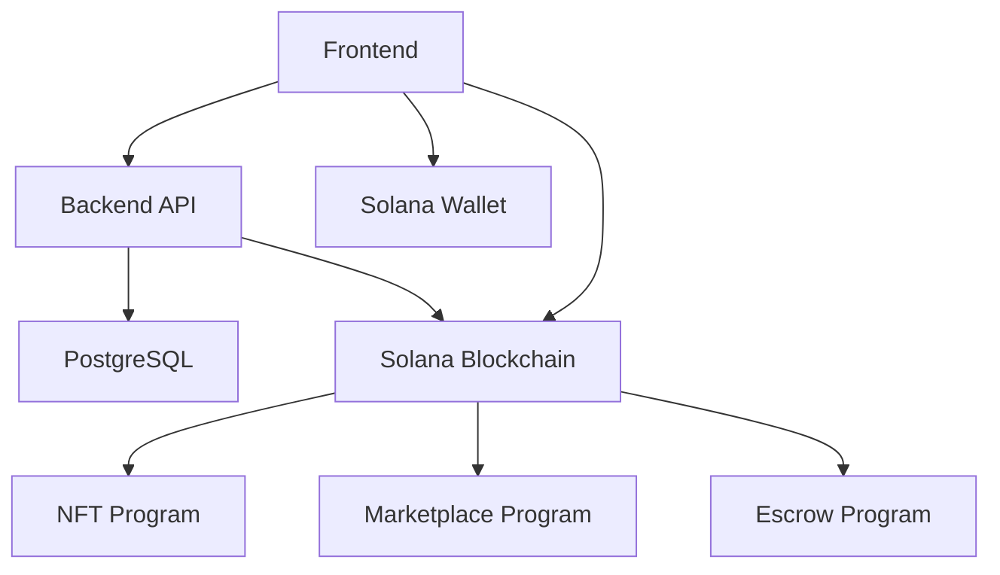

# Kalenda

Kalenda is a revolutionary Web3 marketplace built on the Solana blockchain that allows you to tokenize your time and sell it as an NFT. We merge the seamless scheduling experience of modern calendar apps with the power and security of decentralized technology, creating a unique platform for experts, creators, and their audiences to connect.

## Table of Contents

- [Overview](#overview)
- [Features](#features)
- [Technology Stack](#technology-stack)
- [Architecture](#architecture)
- [Getting Started](#getting-started)
- [Development](#development)
- [Testing](#testing)
- [Deployment](#deployment)
- [Contributing](#contributing)
- [License](#license)

## Overview

Kalenda is a decentralized marketplace that enables creators to tokenize their time and sell it as NFTs on the Solana blockchain. Buyers can purchase these time slots through fixed-price sales or auctions, with funds held in a secure escrow system until meeting completion.

## Features

- **Wallet Authentication**: Connect with Solana wallets (Phantom, Solflare)
- **Time Slot NFTs**: Mint your availability as unique NFTs
- **Marketplace**: Buy time slots through fixed-price sales or auctions
- **Escrow System**: Secure fund handling with automatic release
- **Dispute Resolution**: Fair conflict resolution mechanism
- **Calendar Integration**: Visual scheduling interface
- **Real-time Bidding**: Auction functionality with anti-sniping

## Technology Stack

- **Blockchain**: Solana
- **Smart Contracts**: Rust with Anchor framework
- **Frontend**: Next.js with TypeScript and Tailwind CSS
- **Backend**: NestJS with TypeScript
- **Database**: PostgreSQL with Prisma ORM
- **Wallet Integration**: Solana Web3.js

## Architecture



## Getting Started

### Prerequisites

- Node.js 16+
- Rust and Cargo
- Solana CLI tools
- Anchor CLI
- PostgreSQL

### Installation

1. Clone the repository:
   ```bash
   git clone https://github.com/your-username/kalenda.git
   cd kalenda
   ```

2. Install dependencies:
   ```bash
   # Frontend
   cd frontend
   npm install
   
   # Backend
   cd ../backend
   npm install
   
   # Smart Contracts
   cd ../programs
   anchor build
   ```

## Development

### Running Locally

1. Start the backend:
   ```bash
   cd backend
   npm run start:dev
   ```

2. Start the frontend:
   ```bash
   cd frontend
   npm run dev
   ```

3. Deploy contracts to localnet:
   ```bash
   cd programs
   anchor localnet
   ```

## Testing

### Smart Contracts
```bash
cd programs
anchor test
```

### Backend
```bash
cd backend
npm run test
```

### Frontend
```bash
cd frontend
npm run test
```

## Deployment

See [DEPLOYMENT.md](docs/DEPLOYMENT.md) for detailed deployment instructions.

## Contributing

1. Fork the repository
2. Create your feature branch (`git checkout -b feature/AmazingFeature`)
3. Commit your changes (`git commit -m 'Add some AmazingFeature'`)
4. Push to the branch (`git push origin feature/AmazingFeature`)
5. Open a pull request

## License

This project is licensed under the MIT License - see the [LICENSE](LICENSE) file for details.