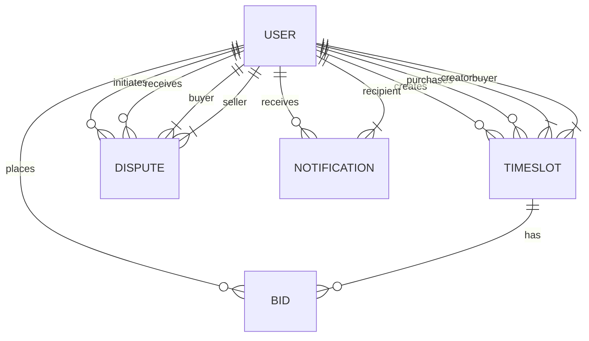

# Database Schema Documentation

## Overview
This document describes the database schema for the Kalenda application. The schema is designed to store user profiles, time slot listings, bids, disputes, and notifications.

## Entity Relationship Diagram

## Tables

### User
Stores information about users (both creators and buyers).

| Column | Type | Constraints | Description |
|--------|------|-------------|-------------|
| id | SERIAL | PRIMARY KEY | Unique identifier |
| walletAddress | TEXT | UNIQUE, NOT NULL | Solana wallet address |
| name | TEXT | NULLABLE | User's display name |
| avatar | TEXT | NULLABLE | URL to avatar image |
| bio | TEXT | NULLABLE | User biography |
| twitter | TEXT | NULLABLE | Twitter profile link |
| linkedin | TEXT | NULLABLE | LinkedIn profile link |
| website | TEXT | NULLABLE | Personal website link |
| specialties | TEXT[] | NULLABLE | Array of user specialties |
| rating | DOUBLE PRECISION | DEFAULT 0.0 | User rating |
| createdAt | TIMESTAMP | DEFAULT NOW() | Creation timestamp |
| updatedAt | TIMESTAMP | NOT NULL | Last update timestamp |

### TimeSlot
Represents a time slot that can be sold as an NFT.

| Column | Type | Constraints | Description |
|--------|------|-------------|-------------|
| id | SERIAL | PRIMARY KEY | Unique identifier |
| creatorId | INTEGER | FOREIGN KEY | Reference to User.id |
| buyerId | INTEGER | FOREIGN KEY, NULLABLE | Reference to User.id |
| startTime | TIMESTAMP | NOT NULL | Start time of the slot |
| endTime | TIMESTAMP | NOT NULL | End time of the slot |
| title | TEXT | NOT NULL | Title of the time slot |
| description | TEXT | NOT NULL | Description of the time slot |
| price | DOUBLE PRECISION | NOT NULL | Price in SOL |
| status | TEXT | DEFAULT 'AVAILABLE' | Slot status (AVAILABLE, SOLD, COMPLETED) |
| createdAt | TIMESTAMP | DEFAULT NOW() | Creation timestamp |
| updatedAt | TIMESTAMP | NOT NULL | Last update timestamp |

### Bid
Represents a bid on a time slot auction.

| Column | Type | Constraints | Description |
|--------|------|-------------|-------------|
| id | SERIAL | PRIMARY KEY | Unique identifier |
| timeSlotId | INTEGER | FOREIGN KEY | Reference to TimeSlot.id |
| bidderId | INTEGER | FOREIGN KEY | Reference to User.id |
| amount | DOUBLE PRECISION | NOT NULL | Bid amount in SOL |
| createdAt | TIMESTAMP | DEFAULT NOW() | Creation timestamp |

### Dispute
Represents a dispute between a buyer and seller.

| Column | Type | Constraints | Description |
|--------|------|-------------|-------------|
| id | SERIAL | PRIMARY KEY | Unique identifier |
| buyerId | INTEGER | FOREIGN KEY | Reference to User.id |
| sellerId | INTEGER | FOREIGN KEY | Reference to User.id |
| reason | TEXT | NOT NULL | Reason for dispute |
| evidence | TEXT | NULLABLE | Evidence link |
| status | TEXT | DEFAULT 'OPEN' | Dispute status (OPEN, RESOLVED, CLOSED) |
| resolution | TEXT | NULLABLE | Resolution outcome |
| createdAt | TIMESTAMP | DEFAULT NOW() | Creation timestamp |
| updatedAt | TIMESTAMP | NOT NULL | Last update timestamp |

### Notification
Stores notifications for users.

| Column | Type | Constraints | Description |
|--------|------|-------------|-------------|
| id | SERIAL | PRIMARY KEY | Unique identifier |
| userId | INTEGER | FOREIGN KEY | Reference to User.id |
| message | TEXT | NOT NULL | Notification message |
| read | BOOLEAN | DEFAULT false | Read status |
| createdAt | TIMESTAMP | DEFAULT NOW() | Creation timestamp |

## Enums

### TimeSlotStatus
- AVAILABLE
- SOLD
- COMPLETED

### DisputeStatus
- OPEN
- RESOLVED
- CLOSED

### DisputeResolution
- IN_FAVOR_OF_BUYER
- IN_FAVOR_OF_SELLER