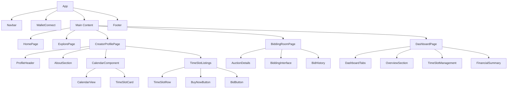

# UI Components Documentation

## Overview
This document describes the UI components for the Kalenda application, including creator profiles, calendar scheduling, bidding rooms, and dashboards.

## 1. Creator Profile Page

### Components
1. **Profile Header**
   - Creator avatar
   - Name and specialty
   - Rating display
   - Social media links

2. **About Section**
   - Biography
   - Specialties/tags
   - Verification badge

3. **Availability Calendar**
   - Visual calendar display
   - Color-coded time slots
   - Filtering options (fixed price vs auction)

4. **Time Slot Listings**
   - Table view of available time slots
   - Sort by date, price, type
   - Action buttons (Buy Now, Bid)

### Design Elements
- Dark theme with purple/indigo gradient
- Clean, minimalist layout
- Responsive design for all devices
- Smooth animations and transitions

## 2. Calendar Scheduling Component

### Features
1. **Month/Week/Day Views**
   - Toggle between different time views
   - Smooth navigation between periods

2. **Time Slot Display**
   - Color coding for different statuses
   - Hover effects for more information
   - Click to view details

3. **Booking Interface**
   - Modal popup for booking details
   - Price and duration information
   - Confirmation workflow

### Implementation Details
- Uses a custom calendar component built with React
- Integrates with backend API for real-time data
- Supports both fixed price and auction listings
- Mobile-responsive touch interactions

## 3. Bidding Room Component

### Features
1. **Auction Details**
   - Current highest bid
   - Time remaining
   - Bid history

2. **Bidding Interface**
   - Bid input field
   - Minimum bid calculation
   - Wallet balance display

3. **Real-time Updates**
   - WebSocket connection for live updates
   - Bid notifications
   - Auto-refresh functionality

### Design Elements
- High-contrast display for auction information
- Countdown timer with visual emphasis
- Bid history in chronological order
- Clear call-to-action buttons

## 4. Dashboard Components

### Creator Dashboard
1. **Overview Section**
   - Total earnings
   - Upcoming meetings
   - Recent activity

2. **Time Slot Management**
   - Create new time slots
   - View existing listings
   - Edit/Delete functionality

3. **Financial Summary**
   - Earnings chart
   - Payment history
   - Withdrawal options

### Buyer Dashboard
1. **My Purchases**
   - Upcoming meetings
   - Past purchases
   - NFT collection view

2. **Bidding Activity**
   - Active bids
   - Won/lost auctions
   - Bid history

3. **Notifications**
   - Meeting reminders
   - Bid updates
   - Payment confirmations

## 5. Shared Components

### Wallet Connection
- Multi-wallet support (Phantom, Solflare)
- Connection status indicator
- Balance display
- Disconnect functionality

### Navigation
- Responsive navbar
- Mobile hamburger menu
- Footer with links

### Modals
- Confirmation dialogs
- Form inputs
- Loading states

### Notifications
- Toast notifications
- In-app notification center
- Email notification preferences

## 6. Component Hierarchy

## 7. Responsive Design

### Mobile First Approach
- Optimized for mobile devices
- Touch-friendly interactions
- Collapsible menus and sections

### Tablet Optimization
- Multi-column layouts
- Larger touch targets
- Enhanced navigation

### Desktop Experience
- Full-featured interface
- Keyboard shortcuts
- Advanced filtering options

## 8. Accessibility

### WCAG Compliance
- Proper contrast ratios
- Keyboard navigation
- Screen reader support
- Focus management

### ARIA Labels
- Descriptive labels for interactive elements
- Status announcements
- Form field descriptions

## 9. Performance Considerations

### Lazy Loading
- Components loaded on demand
- Code splitting for faster initial load
- Image optimization

### Caching
- Local storage for user preferences
- Session caching for frequently accessed data
- Service workers for offline functionality

## 10. State Management

### React Context
- Global state for user authentication
- Wallet connection status
- Notification system

### Component State
- Local state for forms and inputs
- UI interaction states
- Loading and error states

### Data Fetching
- SWR for data caching and revalidation
- Error boundaries for graceful failure
- Loading skeletons for better UX

## 11. Styling with Tailwind CSS

### Design System
- Consistent color palette
- Typography hierarchy
- Spacing scale
- Component variants

### Custom Classes
- Gradient backgrounds
- Animated transitions
- Responsive utilities
- Dark mode support

## 12. Integration Points

### Backend API
- RESTful endpoints
- Error handling
- Loading states
- Pagination

### Solana Wallet
- Transaction signing
- Balance queries
- Connection management
- Error handling

### Real-time Updates
- WebSocket connections
- Event handling
- Reconnection logic
- Fallback mechanisms